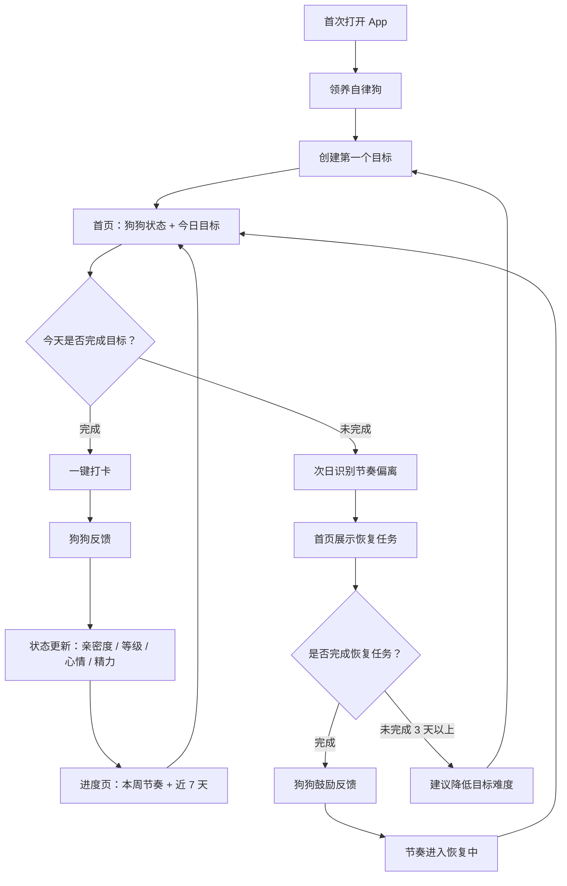

# 自律狗 MVP 核心用户流程

来源：[MVP PRD](../docs/zilvgou-mvp-prd.md)、[用户故事 Backlog](../backlog/mvp-user-stories.md)、[第一版开发顺序](../backlog/mvp-build-plan.md)

## 设计目标

自律狗 MVP 的第一版体验要验证一件事：用户是否会因为一只“陪自己变好”的狗狗，每天回来完成目标。

首版体验不追求完整习惯管理，而追求一个短、轻、有反馈的核心闭环：

领养狗狗 → 创建健身目标 → 今日打卡 → 狗狗反馈 → 看到成长 → 断了也能回来。

## 体验原则

- 先建立关系，再配置任务。
- 首屏优先展示狗狗、今日目标和一个明确动作。
- 健身是默认场景，学习和作息作为可选模板。
- 用户完成打卡后，必须立刻看到狗狗反馈和至少一个状态变化。
- 中断不叫失败，叫“节奏乱了”。
- 亲密度和等级不下降，生活状态可以轻微波动。
- 游客可以先体验，登录只在保存长期进度时出现。

## 核心流程图

## 页面结构

### 1. 领养页

目标：让用户觉得自己是在选择陪伴伙伴，而不是创建工具账号。

页面内容：

- 标题：选一只陪你自律的小狗。
- 狗狗选择列表：柴犬、金毛、边牧、中华田园犬。
- 每只狗狗展示品种、性格和反馈示例。
- 主按钮：领养它。
- 次级提示：先体验，登录后保存进度。

首版狗狗：

| 狗狗 | 性格 | 反馈语气 |
| --- | --- | --- |
| 柴犬 | 热血、直接、有劲 | 短句、积极、像运动搭子 |
| 金毛 | 温暖、稳定、鼓励 | 温柔、耐心、认可努力 |
| 边牧 | 聪明、敏锐、督促 | 清晰、理性、有一点推动感 |
| 中华田园犬 | 踏实、亲近、韧性 | 接地气、稳定、像一直在身边的伙伴 |

选择规则：

- 用户按个人喜好选择狗狗。
- 狗狗品种不绑定健身、学习、作息或任何目标类型。
- 狗狗品种只影响视觉形象、性格标签和反馈语气。
- 所有狗狗都可以陪伴任何自律目标。

示例文案：

- 柴犬：今天动起来就赢了，我已经准备好陪跑。
- 金毛：不用一下子很厉害，我们先稳稳开始。
- 边牧：目标要小，但动作要真。先完成今天这一项。
- 中华田园犬：慢一点也没事，我陪你把今天接回来。

### 2. 目标创建页

目标：90 秒内创建第一个目标。

页面内容：

- 默认推荐：健身。
- 场景切换：健身、学习、作息。
- 模板卡片。
- 目标名称。
- 频率。
- 提醒时间。
- 主按钮：开始今天的节奏。

模板：

| 场景 | 默认模板 | 恢复任务 |
| --- | --- | --- |
| 健身 | 运动 20 分钟 | 拉伸 3 分钟 |
| 健身 | 拉伸 10 分钟 | 原地活动 2 分钟 |
| 学习 | 学习 30 分钟 | 看 1 页 |
| 学习 | 背单词 20 个 | 背 5 个单词 |
| 作息 | 23:30 前睡觉 | 睡前放下手机 5 分钟 |
| 作息 | 睡前少刷手机 | 整理明天计划 |

首版限制：

- MVP 最多创建 3 个目标。
- 首页只突出一个主目标。
- 健身模板默认排第一。

### 3. 首页

目标：每天打开后，用户马上知道狗狗状态、今天要做什么、点哪里完成。

页面优先级：

1. 狗狗视觉和当前心情。
2. 今日主目标。
3. 一键打卡按钮。
4. 本周节奏简览。
5. 登录保存提示。

首页状态：

| 状态 | 触发条件 | 首页表现 |
| --- | --- | --- |
| 待完成 | 今天还没打卡 | 狗狗期待，按钮为“完成今天” |
| 已完成 | 今天已打卡 | 狗狗开心，按钮为“今天已完成” |
| 恢复任务 | 昨天未完成 | 狗狗温和提醒，按钮为“做个小恢复” |
| 长期中断 | 连续 3 天未完成 | 建议降低目标难度 |
| 暂停 | 目标暂停 | 不计入断签，展示恢复入口 |

首页示例文案：

- 待完成：今天做完 20 分钟运动，我就能精神满满。
- 已完成：今天的节奏接住了，我们都很棒。
- 恢复任务：昨天有点乱没关系，今天做 3 分钟就回来。
- 长期中断：最近计划可能有点重，我们把目标调小一点。

### 4. 打卡确认

目标：保持低成本，不让用户在完成后还被迫填写太多内容。

交互：

- 主动作：一键完成。
- 可选项：备注、心情。
- 完成后直接进入狗狗反馈页。

规则：

- 同一目标同一归属日期只计算一次奖励。
- 重复点击不重复增加亲密度、等级经验、连续节奏。
- 打卡时间保存实际时间戳和归属日期。
- 日期结算建议：本地时区，凌晨 4:00 前归属前一天。

### 5. 狗狗反馈页

目标：让用户感觉“我的努力被看见了”。

页面内容：

- 狗狗表情或动作。
- 一句反馈文案。
- 状态变化摘要。
- 主按钮：看今天的进度。
- 次按钮：回首页。

反馈场景：

| 场景 | 反馈方向 | 状态变化 |
| --- | --- | --- |
| 普通完成 | 肯定今天的动作 | 亲密度 +3，精力 +10 |
| 健身完成 | 强调身体动起来 | 亲密度 +3，精力 +20 |
| 学习完成 | 强调专注和积累 | 亲密度 +3，精力 +10 |
| 作息完成 | 强调放松和照顾自己 | 亲密度 +3，清洁 +20 |
| 连续 3 天 | 给阶段性认可 | 亲密度 +8 |
| 连续 7 天 | 强化关系感 | 亲密度 +20 |
| 恢复完成 | 强调回来比完美重要 | 亲密度 +2 |

禁用文案方向：

- 你又失败了。
- 怎么这么懒。
- 不完成我就不喜欢你了。
- 连这点事都做不到。
- 再不自律就完了。

### 6. 进度页

目标：让用户看见自己和狗狗正在一起成长。

页面内容：

- 当前连续节奏。
- 本周完成率。
- 近 7 天完成情况。
- 亲密度和等级。
- 狗狗主要状态。

首版展示建议：

- 主指标：亲密度、等级、本周完成率。
- 次级状态：心情、饱腹、清洁、精力。
- 不做复杂趋势图。
- 不做年度报告。

### 7. 节奏恢复页或恢复模块

目标：在用户中断后，用更小任务帮用户回来。

触发：

- 昨天应该完成但没有完成目标。

恢复状态：

| 状态 | 条件 | 体验 |
| --- | --- | --- |
| 轻微偏离 | 漏 1 天 | 生成小恢复任务 |
| 恢复中 | 完成恢复任务 | 鼓励，并提示继续 2 天回到稳定 |
| 长期中断 | 连续 3 天以上未完成 | 建议降低目标难度 |

示例文案：

- 节奏乱了一下，不代表前面白做了。
- 今天只做 3 分钟，我们把门重新打开。
- 回来这件事，本身就很重要。
- 最近目标可能太重了，要不要把它调小一点？

## 状态规则 v1

### 基础字段

| 字段 | 类型 | 说明 |
| --- | --- | --- |
| intimacy | number | 亲密度，只升不降 |
| level | number | 等级，由亲密度驱动 |
| mood | enum | 心情，例如期待、开心、失落、恢复中 |
| fullness | number | 饱腹，0-100 |
| cleanliness | number | 清洁，0-100 |
| energy | number | 精力，0-100 |
| rhythmStatus | enum | stable、missed、recovering、paused |

### 亲密度与等级

| 行为 | 亲密度变化 |
| --- | --- |
| 完成今日主目标 | +3 |
| 完成恢复任务 | +2 |
| 连续 3 天保持节奏 | +8 |
| 连续 7 天保持节奏 | +20 |
| 当天未完成 | 0 |
| 暂停目标 | 0 |

等级建议：

| 等级 | 亲密度门槛 |
| --- | --- |
| Lv.1 | 0 |
| Lv.2 | 20 |
| Lv.3 | 50 |
| Lv.4 | 90 |
| Lv.5 | 140 |

### 生活状态

| 行为 | 心情 | 饱腹 | 清洁 | 精力 |
| --- | --- | --- | --- | --- |
| 完成今日主目标 | 开心 | +20 | 0 | +10 |
| 完成健身目标 | 兴奋 | +15 | 0 | +20 |
| 完成学习目标 | 专注 | +10 | 0 | +10 |
| 完成作息目标 | 放松 | +5 | +20 | +15 |
| 当天未完成 | 失落但不责备 | -15 | -10 | -10 |
| 完成恢复任务 | 重新振作 | +10 | +10 | +10 |
| 暂停目标 | 平静 | 冻结 | 冻结 | 冻结 |

约束：

- 所有数值限制在 0-100。
- 亲密度和等级不下降。
- 首页不同时展示过多状态，避免像仪表盘。

## 游客与登录

首版策略：

- 游客可以完成领养、创建第一个目标和首次打卡。
- 游客本地保存狗狗、目标、当日打卡和状态。
- 登录提示出现在首次打卡反馈后、查看更完整进度时、再次打开应用时。
- 登录后迁移游客狗狗和第一个目标。

登录提示文案：

- 登录后保存这只狗狗和今天的进度。
- 你已经开始了，别让这次节奏丢掉。
- 保存后，明天它还会在这里等你。

## 首版埋点

| 事件 | 触发时机 |
| --- | --- |
| guest_experience_started | 游客开始体验 |
| dog_selected | 用户领养狗狗 |
| goal_created | 用户创建目标 |
| first_checkin_completed | 用户完成首次打卡 |
| dog_feedback_viewed | 反馈页展示 |
| progress_viewed | 用户查看进度页 |
| recovery_prompt_viewed | 恢复提示展示 |
| recovery_task_completed | 恢复任务完成 |
| login_prompt_viewed | 登录提示展示 |
| signup_completed | 登录或注册完成 |

## 设计待办

1. 画领养页、目标创建页、首页、反馈页、进度页、恢复任务模块的低保真线框。
2. 为柴犬、金毛、边牧、中华田园犬各写 8 条首版反馈文案。
3. 确认首页首屏只展示哪些状态。
4. 确认是否在 MVP 中接入推送提醒。
5. 确认 App 的视觉方向：成人感、轻松、不过度幼稚。
